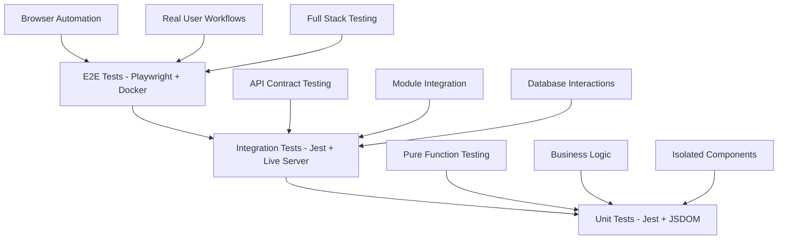
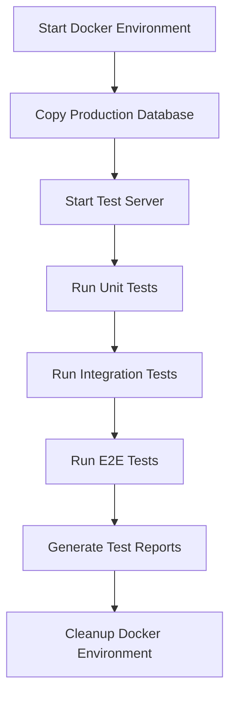

# Docker Test Image: Complete Testing Infrastructure Guide

## Executive Summary

This document provides a comprehensive guide to the testing infrastructure for the `eiw-massage-shop-bookkeeping` project. The system uses a sophisticated three-tier testing strategy with Docker containerization, custom test runners, and specialized bypass mechanisms. This guide is designed for fresh AI contexts with no prior knowledge of the project.

## 1. Testing Architecture Overview

### The Three-Tier Testing Strategy

The project implements a **three-tier testing pyramid** with distinct patterns, frameworks, and execution environments:



### Key Testing Principles

1. **Isolation**: Each test tier runs in complete isolation
2. **Deterministic**: All tests must be reproducible and non-flaky
3. **Comprehensive**: Cover normal cases, edge cases, and error conditions
4. **Maintainable**: Use page objects, helpers, and clear naming conventions
5. **Docker-First**: All tests run against containerized environments

## 2. Docker Test Environment Setup

### Core Docker Configuration

The testing environment is built around two primary Docker configurations:

#### Development Docker Compose (`docker/docker-compose.yml`)
```yaml
services:
  app:
    build: .
    ports:
      - "3000:3000"
    volumes:
      - ../backend:/usr/src/app/backend
      - ../web-app:/usr/src/app/web-app
      - ./data:/app/backend/data
    environment:
      - NODE_ENV=development
      - DB_PATH=/app/backend/data/massage_shop.db
    command: ["npm", "run", "dev"]
```

#### Test Docker Compose (`tests/docker-compose.test.yml`)
```yaml
services:
  app-test:
    build: .
    ports:
      - "3001:3000"
    volumes:
      - ./data:/app/backend/data
    environment:
      - NODE_ENV=test
      - DB_PATH=/app/backend/data/massage_shop.db
      - PWTEST=1
```

### Database Management

**Production Data Integration**:
- E2E tests use real production data via `scp massage:/opt/massage-shop/backend/data/massage_shop.db docker/data/massage_shop.db`
- Integration tests use live database with test-specific data isolation
- Unit tests use complete database mocking with JSDOM

**Database Setup Commands**:
```bash
# Copy production database for E2E tests
scp massage:/opt/massage-shop/backend/data/massage_shop.db docker/data/massage_shop.db

# Start test environment
docker-compose -f tests/docker-compose.test.yml up --build

# Run tests against test environment
npm test
```

## 3. Test Tier Deep Dive

### Tier 1: Unit Tests (`/tests/unit/`)

**Framework**: Jest with JSDOM environment
**Purpose**: Test pure functions and classes in complete isolation
**Pattern**: All external dependencies MUST be mocked

#### Configuration
```javascript
// tests/jest.config.js
module.exports = {
  testEnvironment: 'node',
  verbose: true,
  testMatch: ['**/tests/unit/**/*.test.js'],
  setupFilesAfterEnv: ['<rootDir>/tests/setup/jest.setup.js']
};
```

#### Test Structure Template
```javascript
// tests/unit/your-function.test.js
const { JSDOM } = require('jsdom');

describe('Your Function Test', () => {
  let dom, document, window, appData;
  
  beforeEach(() => {
    // Create fresh DOM environment
    dom = new JSDOM(`<!DOCTYPE html><body></body>`);
    document = dom.window.document;
    window = dom.window;
    
    // Mock global objects
    global.document = document;
    global.window = window;
    global.appData = {};
  });
  
  test('should handle specific scenario', () => {
    // Test implementation with mocked dependencies
  });
});
```

#### Key Examples
- `checkForEdit.regression.test.js` - Tests global state management
- `checkForEdit.edge_cases.test.js` - Tests edge cases and error conditions
- `transaction-status-logic.test.js` - Tests business logic for transaction status

### Tier 2: Integration Tests (`/tests/integration/`)

**Framework**: Jest with live server requests
**Purpose**: Test module interactions against containerized server
**Pattern**: Real HTTP requests to `http://localhost:3000`, NO `supertest(app)` pattern

#### Custom Test Runner
```javascript
// tests/run_integration_tests.js
const { spawn } = require('child_process');
const path = require('path');

async function runIntegrationTests() {
  // Start Docker container
  const docker = spawn('docker-compose', ['-f', 'tests/docker-compose.test.yml', 'up', '--build'], {
    stdio: 'pipe'
  });
  
  // Wait for server to be ready
  await waitForServer('http://localhost:3001');
  
  // Run Jest tests
  const jest = spawn('npx', ['jest', 'tests/integration/'], {
    stdio: 'inherit'
  });
  
  // Cleanup
  jest.on('close', () => {
    docker.kill();
  });
}
```

#### Test Structure Template
```javascript
// tests/integration/your-feature.spec.js
const { requestWithCsrf } = require('../helpers/requestWithCsrf');

describe('Your Feature Integration Test', () => {
  it('should test specific functionality', (done) => {
    // ALWAYS use requestWithCsrf for protected endpoints
    requestWithCsrf({
      url: '/api/your-endpoint',
      method: 'POST',
      body: { 
        // your test data here
      }
    }).then(response => {
      expect(response.status).toBe(200);
      done();
    }).catch(done);
  });
});
```

#### Key Examples
- `transaction-creation.spec.js` - Tests API endpoints with real database
- `csrf-contract.spec.js` - Tests CSRF protection mechanisms
- `homepage.revenue.absent.test.js` - Tests UI contract compliance

### Tier 3: End-to-End Tests (`/tests/e2e/`)

**Framework**: Playwright with browser automation
**Purpose**: Test complete user flows via browser interaction
**Pattern**: Page Object Model with reusable components

#### Playwright Configuration
```typescript
// playwright.config.ts
import { defineConfig } from '@playwright/test';

export default defineConfig({
  testDir: './tests/e2e',
  fullyParallel: true,
  forbidOnly: !!process.env.CI,
  retries: process.env.CI ? 2 : 0,
  workers: process.env.CI ? 1 : undefined,
  reporter: 'html',
  use: {
    baseURL: process.env.BASE_URL || 'http://localhost:3000',
    headless: false,
  },
  projects: [
    {
      name: 'chromium',
      use: { ...devices['Desktop Chrome'] },
    },
  ],
  webServer: {
    command: 'docker-compose -f tests/docker-compose.test.yml up --build',
    url: 'http://localhost:3001',
    reuseExistingServer: !process.env.CI,
  },
});
```

#### Test Structure Template
```javascript
// tests/e2e/your-workflow.spec.js
import { test, expect } from '@playwright/test';

test('your workflow test', async ({ page }) => {
  // Navigate to page
  await page.goto('/your-page.html');
  
  // Perform actions
  await page.getByRole('button', { name: 'Your Button' }).click();
  
  // Verify results
  await expect(page.getByText('Expected Result')).toBeVisible();
});
```

#### Key Examples
- `staff-add-flow.spec.js` - Tests complete staff management workflow
- `transaction-edit-flow.spec.js` - Tests transaction editing with visual verification
- `payment-type-add-flow.spec.js` - Tests payment type management

## 4. PWTEST Bypass System

### Purpose and Activation

The PWTEST system provides comprehensive testing bypass for authentication, CSRF, and rate limiting during testing.

**Activation Methods**:
- Cookie: `PWTEST=1`
- Query Parameter: `?PWTEST=1`
- Header: `x-pwtest: 1`

### Bypassed Systems

1. **Authentication**: Synthetic user with full permissions
2. **CSRF Protection**: Dummy token `pwtest-token` for all requests
3. **Rate Limiting**: Complete bypass for test requests
4. **Session Management**: Fake session with manager role

### Implementation
```javascript
// backend/server.js - PWTEST flag detection
function pwtestFlag(req, res, next) {
  const on = (req.cookies && req.cookies.PWTEST === '1') ||
             req.query?.PWTEST === '1' ||
             req.get('x-pwtest') === '1';
  if (on) {
    req.isPwtest = true;
    res.locals.isPwtest = true;
    res.cookie('PWTEST', '1', { httpOnly: false, sameSite: 'Lax', path: '/' });
  }
  next();
}
```

## 5. CSRF Testing Contract

### Cookie-Mode CSRF Implementation

1. Client requests CSRF token: `GET /csrf`
2. Server responds with `{ "token": "..." }` and sets `_csrf` cookie
3. Client makes protected request with `X-CSRF-Token` header and cookie

### Testing Helpers

#### Jest Integration Helper
```javascript
// tests/helpers/requestWithCsrf.js
const axios = require('axios');

async function requestWithCsrf(options) {
  // Get CSRF token
  const csrfResponse = await axios.get('http://localhost:3000/csrf');
  const csrfToken = csrfResponse.data.token;
  
  // Make request with CSRF token
  return axios({
    ...options,
    baseURL: 'http://localhost:3000',
    headers: {
      'X-CSRF-Token': csrfToken,
      'Cookie': csrfResponse.headers['set-cookie']
    }
  });
}
```

#### Playwright E2E Helper
```typescript
// tests/e2e/helpers/authFlow.ts
export async function postWithCsrf(page: Page, url: string, data: any) {
  // Get CSRF token
  const csrfResponse = await page.request.get('/csrf');
  const csrfData = await csrfResponse.json();
  
  // Make POST request with CSRF token
  return page.request.post(url, {
    data,
    headers: {
      'X-CSRF-Token': csrfData.token
    }
  });
}
```

## 6. Page Object Model (E2E)

### Structure and Components

**Directory**: `tests/e2e/page-objects/`
**Key Components**:
- `LoginPage.js` - Authentication page interactions
- `TransactionPage.js` - Transaction management workflows
- `SummaryPage.js` - Dashboard and reporting interactions

### Page Object Example
```javascript
// tests/e2e/page-objects/LoginPage.js
class LoginPage {
  constructor(page) {
    this.page = page;
    this.selectors = {
      username: '#username',
      password: '#password',
      loginButton: '#login-btn'
    };
  }

  async login(username, password) {
    await this.page.selectOption(this.selectors.username, username);
    await this.page.fill(this.selectors.password, password);
    await this.page.click(this.selectors.loginButton);
    await this.page.waitForURL('/index.html', { timeout: 10000 });
  }
}

module.exports = LoginPage;
```

## 7. Test Execution Commands

### ⚠️ CRITICAL: Custom Test Runners

This project uses **CUSTOM TEST RUNNERS**, not standard npm commands.

#### 1. Integration Tests (Jest + Live Server)
```bash
# ✅ CORRECT: Use the custom integration test runner
npm run test:integration

# ✅ CORRECT: Run specific test file
node tests/run_integration_tests.js tests/integration/your-test.spec.js

# ❌ WRONG: Don't run Jest directly on integration tests
# npx jest tests/integration/your-test.spec.js  # This bypasses server lifecycle
```

#### 2. End-to-End Tests (Playwright + Docker)
```bash
# ✅ CORRECT: Use npm script (starts Docker automatically)
npm test

# ✅ CORRECT: Run specific E2E test
npx playwright test tests/e2e/your-test.spec.js

# ✅ CORRECT: Run with headed browser for debugging
npx playwright test --headed tests/e2e/your-test.spec.js
```

#### 3. Unit Tests (Jest + JSDOM)
```bash
# ✅ CORRECT: Run Jest directly on unit tests
npx jest tests/unit/your-test.js

# ✅ CORRECT: Use the custom Jest runner
node tests/run_jest_tests.js
```

#### 4. Regression Tests (Gauntlet Suite)
```bash
# ✅ CORRECT: Run comprehensive regression tests
node tests/run_gauntlet_tests.js
```

## 8. Test Data Management

### Database Setup Strategies

1. **Production Data**: E2E tests use real production data
2. **Integration Tests**: Live database with test-specific data isolation
3. **Unit Tests**: Complete database mocking with JSDOM

### Test Isolation

- **Port Management**: Integration tests use port 3001 to avoid conflicts
- **Process Management**: Custom server lifecycle with proper cleanup
- **Data Cleanup**: Automatic teardown in E2E tests with confirmation dialogs

## 9. Docker Test Image Workflow

### Complete Test Execution Flow



### Step-by-Step Execution

1. **Environment Setup**:
   ```bash
   # Copy production database
   scp massage:/opt/massage-shop/backend/data/massage_shop.db docker/data/massage_shop.db
   
   # Start Docker environment
   docker-compose -f tests/docker-compose.test.yml up --build -d
   ```

2. **Test Execution**:
   ```bash
   # Run all tests
   npm test
   
   # Or run specific tiers
   npm run test:integration
   npx playwright test tests/e2e/
   ```

3. **Cleanup**:
   ```bash
   # Stop Docker environment
   docker-compose -f tests/docker-compose.test.yml down
   
   # Remove test database
   rm docker/data/massage_shop.db
   ```

## 10. Common Mistakes and Solutions

### ❌ DON'T DO THESE

1. **❌ DON'T** run `npx jest tests/integration/` - use `npm run test:integration`
2. **❌ DON'T** forget to use `requestWithCsrf` for protected endpoints
3. **❌ DON'T** create tests in wrong directories (unit/, integration/, e2e/)
4. **❌ DON'T** forget PWTEST bypass for authentication
5. **❌ DON'T** run integration tests without server lifecycle management
6. **❌ DON'T** use `supertest(app)` - use live server requests
7. **❌ DON'T** forget CSRF tokens for state-changing requests

### ✅ CORRECT PATTERNS

1. **✅ DO** use custom test runners for integration tests
2. **✅ DO** use `requestWithCsrf` for protected endpoints
3. **✅ DO** create tests in correct directories
4. **✅ DO** use PWTEST bypass for authentication
5. **✅ DO** use live server requests for integration tests
6. **✅ DO** use CSRF tokens for state-changing requests

## 11. Debugging and Diagnostics

### Debug Test Execution

```bash
# Run specific test with headed browser
npx playwright test --headed tests/e2e/your-test.spec.js

# Use PWTEST bypass for integration tests
PWTEST=1 npm run test:integration

# Check debug logs
ls tests/debug/

# Use MRE approach for bug isolation
mkdir tests/diagnostics/your-bug-name
```

### Test Environment Verification

```bash
# Check Docker containers
docker ps

# Check test server health
curl http://localhost:3001/api/_health

# Check database connectivity
docker exec -it test-container sqlite3 /app/backend/data/massage_shop.db ".tables"
```

## 12. Performance and Optimization

### Test Execution Performance

- **Unit Tests**: ~5-10 seconds (fastest)
- **Integration Tests**: ~30-60 seconds (medium)
- **E2E Tests**: ~2-5 minutes (slowest)

### Optimization Strategies

1. **Parallel Execution**: E2E tests run in parallel when possible
2. **Docker Caching**: Use Docker layer caching for faster builds
3. **Test Selection**: Run only relevant tests during development
4. **Database Optimization**: Use in-memory SQLite for unit tests

## 13. CI/CD Integration

### GitHub Actions Example

```yaml
# .github/workflows/test.yml
name: Test Suite
on: [push, pull_request]

jobs:
  test:
    runs-on: ubuntu-latest
    steps:
      - uses: actions/checkout@v2
      - name: Setup Node.js
        uses: actions/setup-node@v2
        with:
          node-version: '18'
      - name: Install dependencies
        run: npm install
      - name: Run unit tests
        run: npx jest tests/unit/
      - name: Run integration tests
        run: npm run test:integration
      - name: Run E2E tests
        run: npm test
```

## 14. Troubleshooting Guide

### Common Issues and Solutions

1. **Docker Container Won't Start**:
   - Check port conflicts
   - Verify Docker is running
   - Check container logs

2. **Tests Fail with Database Errors**:
   - Verify database file exists
   - Check database permissions
   - Ensure test data is properly set up

3. **CSRF Token Errors**:
   - Use `requestWithCsrf` helper
   - Check PWTEST bypass is enabled
   - Verify CSRF middleware is working

4. **Playwright Tests Fail**:
   - Check browser installation
   - Verify test selectors
   - Use headed mode for debugging

## 15. Best Practices

### Test Development

1. **Write Tests First**: Use TDD approach
2. **Keep Tests Simple**: One assertion per test
3. **Use Descriptive Names**: Test names should explain what they test
4. **Mock External Dependencies**: Keep tests isolated
5. **Clean Up After Tests**: Remove test data

### Test Maintenance

1. **Regular Updates**: Keep test dependencies updated
2. **Refactor Tests**: Keep tests maintainable
3. **Monitor Test Performance**: Track test execution times
4. **Document Test Changes**: Update test documentation

## 16. Conclusion

This testing infrastructure provides a robust, scalable, and maintainable testing solution for the `eiw-massage-shop-bookkeeping` project. The three-tier approach ensures comprehensive coverage while maintaining fast feedback loops for developers.

Key takeaways:
- Use custom test runners, not standard npm commands
- Always use CSRF helpers for protected endpoints
- Leverage PWTEST bypass for authentication
- Maintain test isolation and determinism
- Use Docker for consistent test environments

For any questions or issues, refer to the test execution logs and debugging guides provided in this document.
