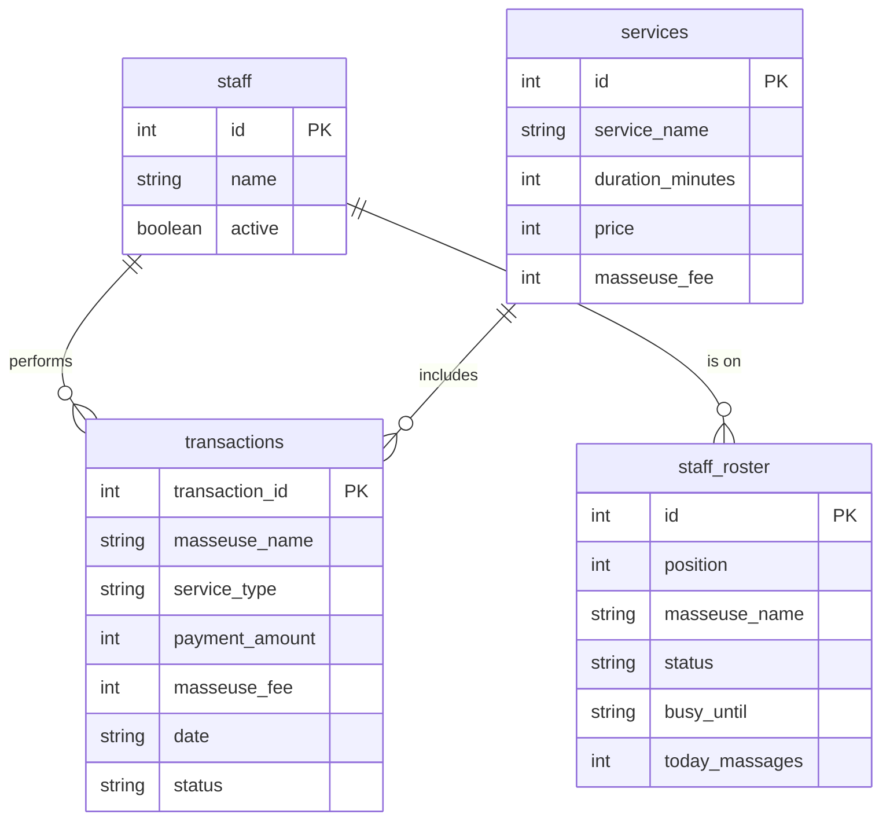
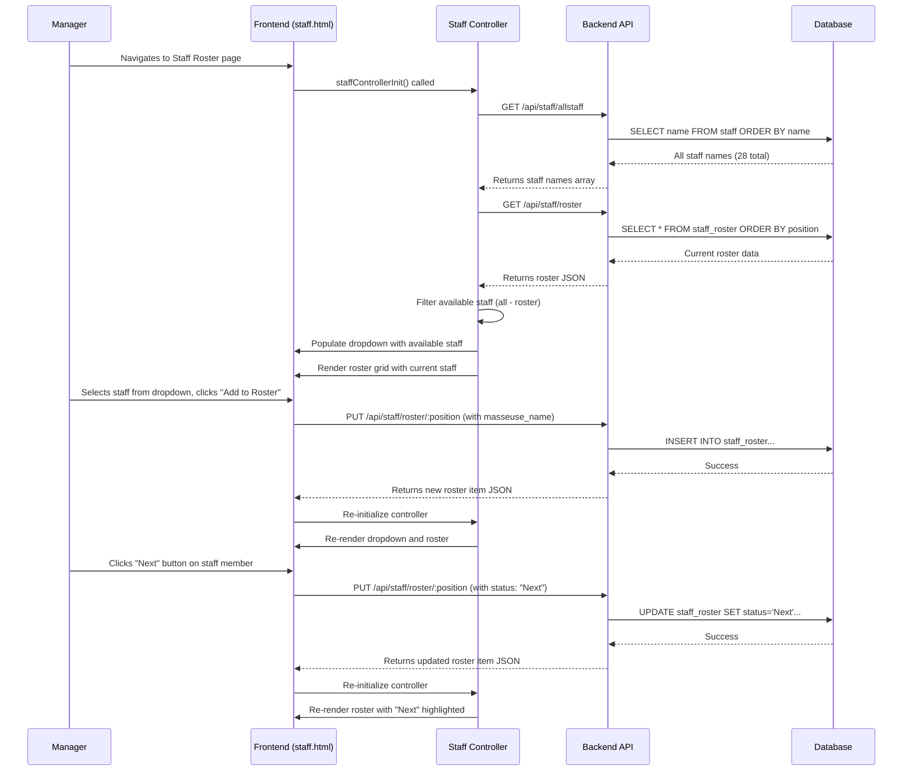
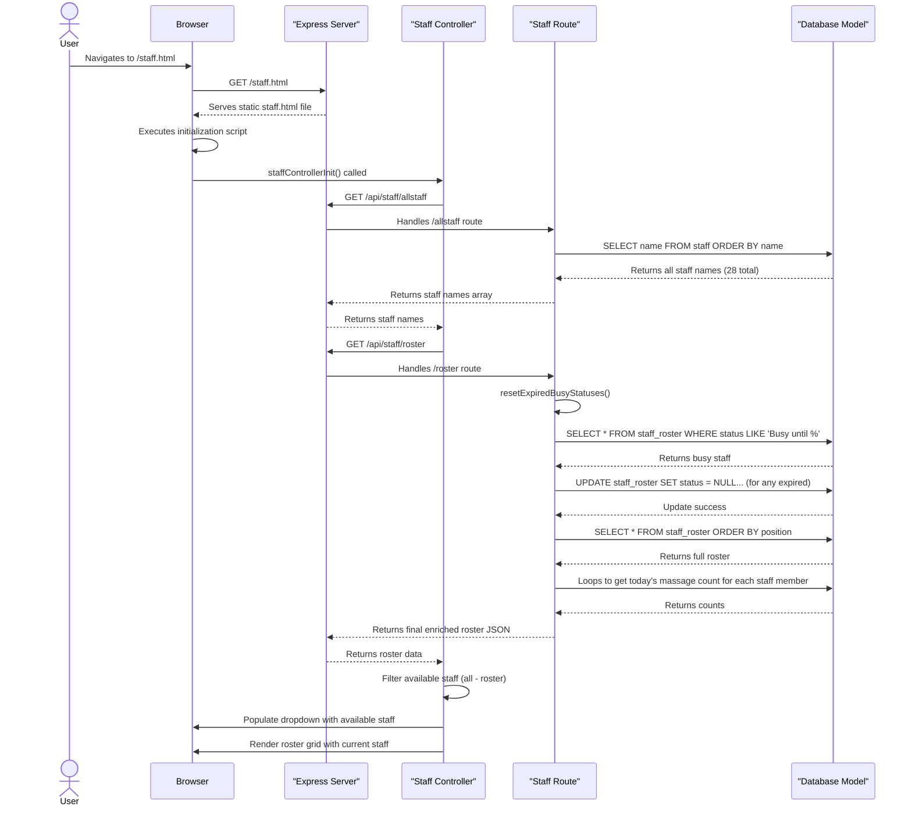
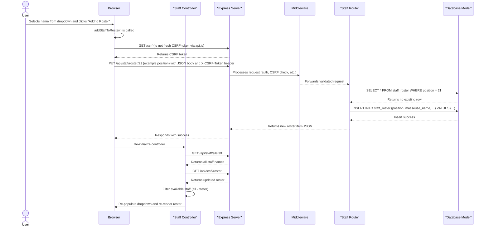

# Repository Context: eiw-massage-shop-bookkeeping

## 1. Executive Summary

This document provides an exhaustive technical analysis of the `eiw-massage-shop-bookkeeping` repository. The project is a full-stack web application designed as a Point of Sale (POS) and bookkeeping system for a massage shop. Its core functionality includes managing daily staff rosters, tracking financial transactions, recording expenses, and generating reports.

The primary technology stack consists of a Node.js backend using the Express.js framework, a SQLite database for data persistence, and a vanilla JavaScript frontend rendered with EJS templating. The entire application is containerized with Docker for consistent development and deployment environments. The system features a robust security model, including session-based authentication, CSRF protection, and rate limiting. A comprehensive testing suite using Playwright, Mocha, and Jest ensures code quality and reliability.

Architecturally, the system follows a monolithic approach where the backend server is responsible for API logic, data access, and rendering frontend pages. The frontend is a traditional multi-page application that uses client-side JavaScript to fetch data from the backend API and dynamically update the UI. The project execution context is well-defined, with clear scripts for development, testing, and linting, all managed via npm.

## 2. Architectural Analysis (Software Architect Persona)

### Component Diagram

The application is a monolith with a clear separation between the frontend and backend concerns, all running within a single Node.js process and served from a single container.

```mermaid
graph TD
    subgraph Browser
        A[User]
    end

    subgraph "Docker Container (Node.js)"
        B[Express Server]
        C[Backend API Routes]
        D[Middleware]
        E[Database Model]
        F[Frontend UI (HTML/JS/CSS)]
    end

    subgraph "File System (Volume)"
        G[SQLite Database]
    end

    A -- HTTP/S Requests --> B
    B -- Serves Static Content --> F
    B -- Routes API Calls --> C
    F -- AJAX/Fetch API Calls --> C
    B -- Uses --> D
    C -- Uses --> D
    D -- Applies Security/Validation --> C
    C -- Uses --> E
    E -- Reads/Writes --> G
```

### Technology Stack

| Category      | Technology        | Version    | Role & Justification                                                                                             |
|---------------|-------------------|------------|------------------------------------------------------------------------------------------------------------------|
| **Backend**   | Node.js           | >=18.0.0   | The runtime environment for the server.                                                                          |
|               | Express.js        | ^4.18.2    | The core web application framework for routing, middleware, and handling requests.                               |
|               | SQLite3           | ^5.1.7     | The relational database engine. It's file-based, simplifying setup and deployment for this scale of application. |
|               | EJS               | ^3.1.10    | The templating engine used for server-side rendering of the frontend pages.                                      |
| **Frontend**  | Vanilla JS (ES6+) | N/A        | Used for all client-side logic, including API calls and dynamic UI updates. No framework is used.                |
|               | HTML5 / CSS3      | N/A        | Standard markup and styling for the user interface.                                                              |
| **Security**  | csurf             | ^1.11.0    | Middleware for Cross-Site Request Forgery (CSRF) protection.                                                     |
|               | bcryptjs          | ^2.4.3     | Library for hashing user passwords before storing them.                                                          |
|               | express-session   | ^1.18.2    | Middleware for managing user sessions.                                                                           |
|               | cookie-parser     | ^1.4.7     | Middleware for parsing cookie headers.                                                                           |
| **Testing**   | Playwright        | ^1.55.0    | Framework for end-to-end testing.                                                                                |
|               | Mocha / Chai      | ^11.7.1    | Framework and assertion library for integration testing.                                                         |
|               | Jest              | ^29.7.0    | Framework for unit testing.                                                                                      |
| **DevOps**    | Docker            | N/A        | Used for containerizing the application for consistent development and deployment.                               |
|               | nodemon           | ^3.0.1     | Monitors for file changes and automatically restarts the server during development.                              |
| **Monitoring**| Sentry            | ^10.5.0    | Error tracking and performance monitoring service.                                                               |

### Data Models & Flow

The system revolves around a few core data models stored in the SQLite database. The main tables are `staff`, `staff_roster`, `transactions`, and `services`.



**Data Flow Example (Creating a Transaction):**
1.  A user on the frontend fills out the "New Transaction" form.
2.  The client-side JavaScript (`shared.js`) captures the form data.
3.  An API call is made via `api.createTransaction()` to `POST /api/transactions`.
4.  The request passes through middleware on the Express server for authentication, CSRF validation, and input validation.
5.  The `transactions` route handler in `backend/routes/transactions.js` receives the validated data.
6.  The handler interacts with the `database` model (`backend/models/database.js`) to insert a new row into the `transactions` table.
7.  The database model executes the `INSERT` SQL statement against the `massage_shop.db` file.
8.  The API route returns a success response to the frontend.

## 3. Implementation Deep Dive (Software Developer Persona)

### Core Logic & Abstractions

1.  **`backend/server.js`**: The application's main entry point. It orchestrates the entire middleware chain, sets up routing, and manages the server lifecycle. The middleware setup is particularly important, establishing a clear pipeline for security and request processing.

2.  **`backend/models/database.js`**: A thin abstraction layer over the `sqlite3` library. It likely encapsulates the database connection and provides simple methods (`get`, `all`, `run`) for executing SQL queries, making it the single point of interaction with the database.

3.  **`web-app/api.js` (`APIClient` class)**: A crucial abstraction on the frontend. This class centralizes all `fetch` calls to the backend, automatically handling CSRF tokens for non-GET requests. This keeps the UI logic clean from the complexities of API communication.

4.  **`web-app/controllers/staff-page-controller.js` (`staffControllerInit` function)**: A modular controller that handles the staff roster page initialization. It fetches all available staff names from `/api/staff/allstaff`, gets the current roster from `/api/staff/roster`, filters out already-selected staff for the dropdown, and renders the roster grid. This represents a move away from the monolithic approach in `shared.js` toward more focused, page-specific controllers.

5.  **`web-app/shared.js` (`loadData` function)**: This function is the primary data hydrator for the frontend. It orchestrates multiple API calls to fetch all necessary configuration and state (roster, services, transactions) and populates the global `appData` object.

6.  **`backend/routes/staff.js` (`resetExpiredBusyStatuses` function)**: This function contains important business logic for the staff roster. It automatically transitions a staff member's status from "Busy" back to "Available" when their scheduled busy time has passed, ensuring the roster reflects real-time availability.
    ```javascript
    // backend/routes/staff.js
    async function resetExpiredBusyStatuses() {
      // ...
      const busyStaff = await database.all(
        `SELECT * FROM staff_roster 
         WHERE status LIKE 'Busy until %' 
         AND (masseuse_name IS NOT NULL AND masseuse_name != '')`
      );
      // ... logic to compare current time with busy_until time ...
      if (isExpired) {
        await database.run(
          `UPDATE staff_roster 
           SET status = NULL, busy_until = NULL, ...
           WHERE position = ?`,
          [staff.position]
        );
      }
    }
    ```

### API Contracts & Entry Points

The backend exposes a RESTful API under the `/api/` prefix. Key entry points include:

| Method | Endpoint                       | Description                                                     |
|--------|--------------------------------|-----------------------------------------------------------------|
| `GET`  | `/api/staff/roster`            | Fetches the current daily staff roster with updated massage counts. |
| `PUT`  | `/api/staff/roster/:position`  | Updates or creates a staff member entry at a specific position. |
| `DEL`  | `/api/staff/roster/:position`  | Removes a staff member from the roster and re-indexes.          |
| `GET`  | `/api/staff/allstaff`          | Gets a list of all staff names (28 total) for populating dropdowns. |
| `POST` | `/api/transactions`            | Creates a new financial transaction.                            |
| `GET`  | `/api/transactions/recent`     | Gets a list of recent transactions.                             |
| `GET`  | `/api/reports/summary/today`   | Gets a summary of today's financial performance.                |
| `POST` | `/api/auth/login`              | Authenticates a user and starts a session.                      |
| `POST` | `/api/auth/logout`             | Logs out the current user and destroys the session.             |
| `GET`  | `/csrf`                        | Provides a CSRF token for the frontend to use in requests.      |

### Code Conventions & Patterns

*   **Monolithic Structure:** The application is a classic monolith, with frontend and backend code co-located in the same repository and running in the same process.
*   **MVC-like Pattern:** The backend loosely follows a Model-View-Controller pattern. The `routes` act as controllers, the `models/database.js` is the model layer, and the `.ejs` files in `web-app` are the views.
*   **Co-Located Documentation:** The presence of `.md` files alongside source files (e.g., `backend/routes/staff.js.md`) indicates a deliberate practice of keeping documentation close to the code it describes.
*   **Global State on Frontend:** The frontend relies on a global `appData` object (`shared.js`) for state management. Data is loaded into this object, and UI components read from it to render themselves. This is a simple pattern that avoids the complexity of a formal state management library.
*   **Modular Controller Pattern:** The staff page uses a new modular architecture where `staff-page-controller.js` handles the core logic (dropdown population, roster rendering), while `roster-ui.js` provides drag-and-drop functionality. The main `staff.html` contains minimal inline scripts for initialization and PWTEST support, representing a move toward cleaner separation of concerns.

### Dependency Management

All dependencies are managed in the root `package.json` file.

*   **Express.js Ecosystem:** `express`, `cookie-parser`, `cors`, `express-session` form the core of the web server.
*   **Database:** `sqlite3` is the only database driver.
*   **Security:** `bcryptjs` for password hashing, `csurf` for CSRF protection.
*   **Testing:** A rich testing stack with `@playwright/test` for E2E, `mocha` and `chai` for integration, and `supertest` for API testing.
*   **Development:** `nodemon` for hot-reloading, `eslint` for linting.

## 4. Product & Feature Analysis (Product Manager Persona)

### Feature Inventory

Based on the API routes, UI files, and project documentation, the epic-level features are:

*   **Transaction Management:** The ability to create, view, and correct financial transactions for services rendered.
*   **Staff Roster Management:** A dynamic daily roster to manage which staff members are working, their order in the queue, and their current status (available, busy, next).
*   **Reporting & Analytics:** Generation of daily, weekly, and monthly financial summaries, as well as staff performance reports.
*   **Expense Tracking:** The ability to record and view daily expenses.
*   **User Authentication:** A login system with roles (e.g., manager) to control access to different parts of the application.
*   **Admin Panel:** A dedicated section for administrative tasks like managing the master list of staff, services, and payment types.

### User Flow

**User Flow: Managing the Daily Staff Roster**

This flow describes how a manager sets up and manages the staff roster for the day using the new modular architecture.



### Module-to-Feature Mapping

| Feature                 | Primary Source Code Modules                                                                                               |
|-------------------------|---------------------------------------------------------------------------------------------------------------------------|
| Staff Roster Management | `web-app/staff.html` (UI template), `web-app/controllers/staff-page-controller.js` (dropdown population), `web-app/roster-ui.js` (drag-and-drop), `backend/routes/staff.js` (API endpoints) |
| Transaction Management  | `web-app/transaction.html`, `web-app/shared.js`, `backend/routes/transactions.js`                                           |
| Reporting & Analytics   | `web-app/summary.html`, `backend/routes/reports.js`                                                                         |
| Authentication          | `web-app/login.html`, `web-app/shared.js` (auth functions), `backend/routes/auth.js`, `backend/middleware/` (security files) |
| Administration          | `web-app/admin-*.html` files, `backend/routes/admin.js`                                                                      |

## 5. Project Execution & Operational Context (CRITICAL SECTION)

### Configuration Map

Configuration is primarily managed through environment variables, loaded by `dotenv`.

| Variable         | Source                | Purpose                                                         | Type   | Default/Example Value                       |
|------------------|-----------------------|-----------------------------------------------------------------|--------|---------------------------------------------|
| `PORT`           | Environment Variable  | The port on which the Express server listens.                   | Number | `3000`                                      |
| `DB_PATH`        | Environment Variable  | The absolute file path to the SQLite database.                  | String | `/app/backend/data/massage_shop.db` (in Docker) |
| `ALLOWED_ORIGINS`| Environment Variable  | Comma-separated list of origins allowed by CORS.                | String | `'http://localhost:3000,http://localhost:8080'` |
| `NODE_ENV`       | Environment Variable  | The application environment (e.g., `development`, `production`).| String | `development`                               |
| `SENTRY_DSN`     | Environment Variable  | The Data Source Name for connecting to Sentry for monitoring.   | String | `(not set)`                                 |
| `PWTEST`         | Cookie / Query Param  | A special flag to bypass security measures (CSRF, rate-limit) during testing. | String | `1`                                         |

### Environment & Tooling

*   **Build Process:** There is no explicit build step for the application itself, as it is an interpreted Node.js project. Dependencies are installed via `npm install`.

*   **Running the Application:**
    *   **Development:** `npm run dev` (uses `nodemon` for hot-reloading).
    *   **Production:** `npm start` (uses `node`).

*   **Testing Framework:**
    *   The primary test command is `npm test`, which aliases to `npm run test:e2e`.
    *   **E2E Tests:** `npm run test:e2e` runs Playwright tests. The script first uses `scp` to copy a database from a remote server (`massage`) to ensure tests run against realistic data.
        ```bash
        # package.json
        "test:e2e": "scp massage:/opt/massage-shop/backend/data/massage_shop.db docker/data/massage_shop.db && npx playwright test"
        ```
    *   **Integration Tests:** `npm run test:integration` runs tests using a custom script, likely executing Mocha tests.

*   **Linting:**
    *   `npm run lint` executes a pre-commit hook script (`scripts/pre-commit-hook.sh`) which presumably runs ESLint to enforce code style.

*   **CI/CD:** No CI/CD pipeline configuration files (e.g., `.github/workflows`) are present in the repository, suggesting that deployment might be a manual or externally scripted process.

### Containerization

*   **`Dockerfile` Analysis:**
    *   **Base Image:** `node:18.20.8-slim`, a specific and lightweight version of Node.js.
    *   **Setup:** It installs the `sqlite3` CLI tool, which is useful for debugging inside the container. It then copies the entire project and runs `npm install`.
    *   **Execution:** The container exposes port `3000` and runs the application with `CMD [ "node", "backend/server.js" ]`.

*   **`docker-compose.yml` Analysis:**
    *   **Services:** Defines two services: `app` and `db`.
    *   **`app` Service:** This is the main application service.
        *   It builds the image using the `Dockerfile`.
        *   It maps port `3000` to the host.
        *   Crucially, it uses volumes to mount the host's source code (`../backend`, `../web-app`) into the container. This is a development setup that allows `nodemon` to detect changes and restart the server without rebuilding the image.
        *   It also mounts a local `./data` directory to persist the SQLite database.
    *   **`db` Service:** This is a data-only container. It uses a generic `alpine` image and its sole purpose is to manage the named volume for the database, ensuring it is created before the `app` service starts.

### End-to-End Flow Tracing

**Flow 1: Loading the Staff Roster Page**

This sequence shows what happens when a user first loads the staff management page using the new modular controller architecture.



**Flow 2: Adding a New Staff Member to the Roster**

This sequence traces the process of adding a new person to the daily roster using the new controller architecture.


